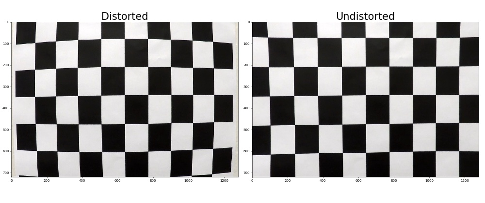
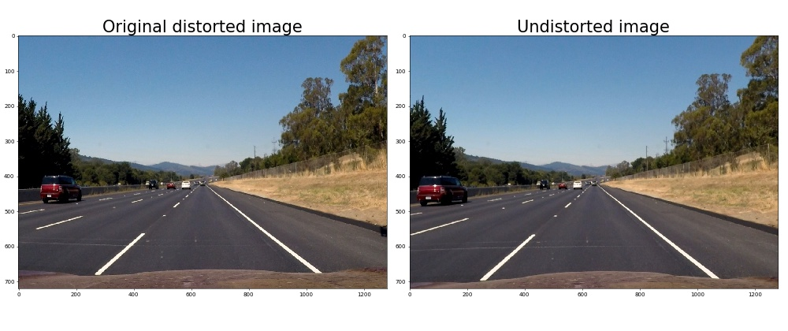
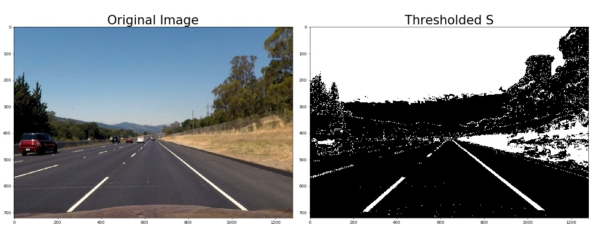
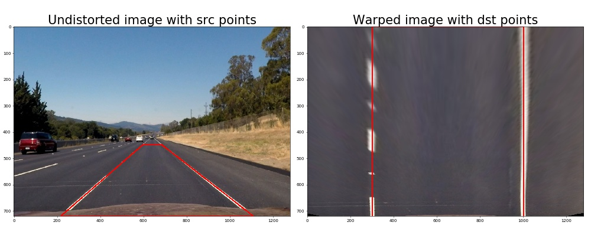
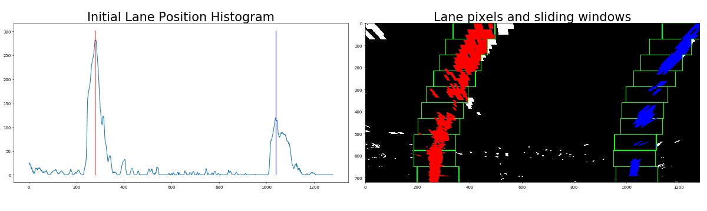

# Project: Advanced Lane Finding

The goals / steps of this project are the following:

* Compute the camera calibration matrix and distortion coefficients given a set of chessboard images.
* Apply a distortion correction to raw images.
* Use color transforms, gradients, etc., to create a thresholded binary image.
* Apply a perspective transform to rectify binary image ("birds-eye view").
* Detect lane pixels and fit to find the lane boundary.
* Determine the curvature of the lane and vehicle position with respect to center.
* Warp the detected lane boundaries back onto the original image.
* Output visual display of the lane boundaries and numerical estimation of lane curvature and vehicle position.

[//]: # (Image References)

[image1]: ./examples/undistort_output.png "Undistorted"
[image2]: ./test_images/test1.jpg "Road Transformed"
[image3]: ./examples/binary_combo_example.jpg "Binary Example"
[image4]: ./examples/warped_straight_lines.jpg "Warp Example"
[image5]: ./examples/color_fit_lines.jpg "Fit Visual"
[image6]: ./examples/example_output.jpg "Output"
[video1]: ./project_video.mp4 "Video"

In the following, I will consider each [rubric](https://review.udacity.com/#!/rubrics/571/view) point individually and describe how I addressed it in my implementation.

The entire implementation is contained in the `Advanced_Lane_Lines.ipynb` ipython script.

---
###Camera Calibration

####1. Briefly state how you computed the camera matrix and distortion coefficients. Provide an example of a distortion corrected calibration image.
The code for this step is contained under *Camera calibration* in `Advanced_Lane_Lines.ipynb`.

First, I use the chessboard calibration images to prepare corresponding image and world coordinates of chessboard corners.
World coordinates (`objp` in code) are the same for all chessboards and generated synthetically.
For image coordinates, I use the OpenCV function `cv2.findChessboardCorners` to find corner coordinates in all the images.

The paired coordinates are then appended to a list, such that all corners from all calibration images are used together.

Next, I compute the camera calibration and distortion coefficients using the `cv2.calibrateCamera` function.
With this, I am then able to undistort the same calibration images.
The following images show an example of this procedure for the original image *calibration1.jpg*.



###Pipeline (test images)

####1. Provide an example of a distortion-corrected image.
The code for this step is contained under *Distortion correction* in `Advanced_Lane_Lines.ipynb`.

The code simply calls `cv2.undistort` on the image with the before mentioned calibration and distortion coefficients.
An example is shown below.



####2. Describe how (and identify where in your code) you used color transforms, gradients or other methods to create a thresholded binary image. Provide an example of a binary image result.
The code for this step is contained under *Thresholded binary image* in `Advanced_Lane_Lines.ipynb`.

I used a combination of color and gradient thresholds to generate a binary image.

I first convert the image to HLS colorspace and extract H,L, and S components.
Here, I only use a combination of L and S that has proven to handle shadows quite well.
Specifically, I threshold the two and pass only pixels that have (`L < L_thresh_low` or `L > L_thresh_high`) and `S_thresh_low < S < S_thresh_high`.

I then compute sobel x and y gradients and use a combination of the two, such that I only pass pixels that have `x_thresh_low < sobelx < x_thresh_high` and `y_thresh_low < sobely < y_thresh_high`.

I then compute gradient magnitude and direction using the sobel gradients computed above.
I use a combination of these and pass only pixels that have `mag_thresh_low < mag < mag_thresh_high` and `dir_thresh_low < dir < dir_thresh_high`.

In the end, I combine all three components such that a pixel is passed if any of the three components passes.
An example is shown below.



####3. Describe how (and identify where in your code) you performed a perspective transform and provide an example of a transformed image.
The code for this step is contained under *Perspective transform* in `Advanced_Lane_Lines.ipynb`.

I 



The code for my perspective transform includes a function called `warper()`, which appears in lines 1 through 8 in the file `example.py` (output_images/examples/example.py) (or, for example, in the 3rd code cell of the IPython notebook).  The `warper()` function takes as inputs an image (`img`), as well as source (`src`) and destination (`dst`) points.  I chose the hardcode the source and destination points in the following manner:

```
src = np.float32(
    [[(img_size[0] / 2) - 55, img_size[1] / 2 + 100],
    [((img_size[0] / 6) - 10), img_size[1]],
    [(img_size[0] * 5 / 6) + 60, img_size[1]],
    [(img_size[0] / 2 + 55), img_size[1] / 2 + 100]])
dst = np.float32(
    [[(img_size[0] / 4), 0],
    [(img_size[0] / 4), img_size[1]],
    [(img_size[0] * 3 / 4), img_size[1]],
    [(img_size[0] * 3 / 4), 0]])

```
This resulted in the following source and destination points:

| Source        | Destination   | 
|:-------------:|:-------------:| 
| 585, 460      | 320, 0        | 
| 203, 720      | 320, 720      |
| 1127, 720     | 960, 720      |
| 695, 460      | 960, 0        |

I verified that my perspective transform was working as expected by drawing the `src` and `dst` points onto a test image and its warped counterpart to verify that the lines appear parallel in the warped image.

![alt text][image4]

####4. Describe how (and identify where in your code) you identified lane-line pixels and fit their positions with a polynomial?



text


Then I did some other stuff and fit my lane lines with a 2nd order polynomial kinda like this:

![alt text][image5]

####5. Describe how (and identify where in your code) you calculated the radius of curvature of the lane and the position of the vehicle with respect to center.

I did this in lines # through # in my code in `my_other_file.py`

####6. Provide an example image of your result plotted back down onto the road such that the lane area is identified clearly.

I implemented this step in lines # through # in my code in `yet_another_file.py` in the function `map_lane()`.  Here is an example of my result on a test image:

![alt text][image6]

---

###Pipeline (video)

####1. Provide a link to your final video output.  Your pipeline should perform reasonably well on the entire project video (wobbly lines are ok but no catastrophic failures that would cause the car to drive off the road!).

Here's a [link to my video result](./project_video.mp4)

---

###Discussion

####1. Briefly discuss any problems / issues you faced in your implementation of this project.  Where will your pipeline likely fail?  What could you do to make it more robust?

Here I'll talk about the approach I took, what techniques I used, what worked and why, where the pipeline might fail and how I might improve it if I were going to pursue this project further.  

