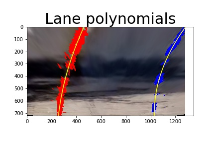
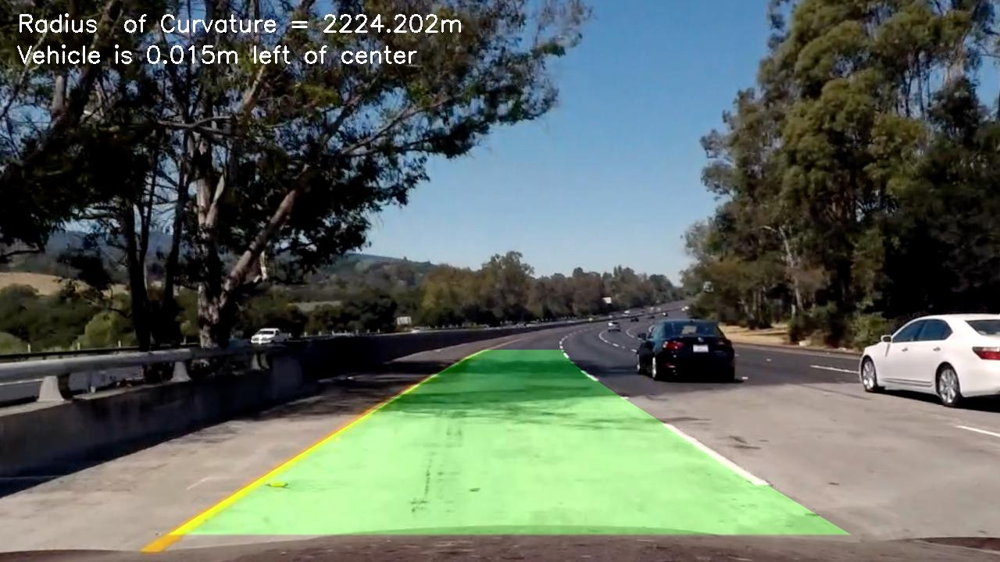

# Project: Advanced Lane Finding

The goals / steps of this project are the following:

* Compute the camera calibration matrix and distortion coefficients given a set of chessboard images.
* Apply a distortion correction to raw images.
* Use color transforms, gradients, etc., to create a thresholded binary image.
* Apply a perspective transform to rectify binary image ("birds-eye view").
* Detect lane pixels and fit to find the lane boundary.
* Determine the curvature of the lane and vehicle position with respect to center.
* Warp the detected lane boundaries back onto the original image.
* Output visual display of the lane boundaries and numerical estimation of lane curvature and vehicle position.

[//]: # (Image References)

[image1]: ./examples/undistort_output.png "Undistorted"
[image2]: ./test_images/test1.jpg "Road Transformed"
[image3]: ./examples/binary_combo_example.jpg "Binary Example"
[image4]: ./examples/warped_straight_lines.jpg "Warp Example"
[image5]: ./examples/color_fit_lines.jpg "Fit Visual"
[image6]: ./examples/example_output.jpg "Output"
[video1]: ./project_video.mp4 "Video"

In the following, I will consider each [rubric](https://review.udacity.com/#!/rubrics/571/view) point individually and describe how I addressed it in my implementation.

The entire implementation is contained in the `Advanced_Lane_Lines.ipynb` ipython script.
The first cells define a number of functions needed for the processing pipeline.
These are all combined under *Pipeline function (combine all the above)* near the bottom of the script.

---
###Camera Calibration

####1. Briefly state how you computed the camera matrix and distortion coefficients. Provide an example of a distortion corrected calibration image.
The code for this step is contained under *Camera calibration* in `Advanced_Lane_Lines.ipynb`.

First, I use the chessboard calibration images to prepare corresponding image and world coordinates of chessboard corners.
World coordinates (`objp` in code) are the same for all chessboards and generated synthetically.
For image coordinates, I use the OpenCV function `cv2.findChessboardCorners` to find corner coordinates in all the images.

The paired coordinates are then appended to a list, such that all corners from all calibration images are used together.

Next, I compute the camera calibration and distortion coefficients using the `cv2.calibrateCamera` function.
With this, I am then able to undistort the same calibration images.
The following images show an example of this procedure for the original image *calibration1.jpg*.


###Pipeline (test images)

####1. Provide an example of a distortion-corrected image.
The code for this step is contained under *Distortion correction* in `Advanced_Lane_Lines.ipynb`.

The code simply calls `cv2.undistort` on the image with the before mentioned calibration and distortion coefficients.
An example is shown below.


####2. Describe how (and identify where in your code) you used color transforms, gradients or other methods to create a thresholded binary image. Provide an example of a binary image result.
The code for this step is contained under *Thresholded binary image* in `Advanced_Lane_Lines.ipynb`.

I used a combination of color and gradient thresholds to generate a binary image.

I first convert the image to HLS colorspace and extract H,L, and S components.
Here, I only use a combination of L and S that has proven to handle shadows quite well.
Specifically, I threshold the two and pass only pixels that have (`L < L_thresh_low` or `L > L_thresh_high`) and `S_thresh_low < S < S_thresh_high`.

I then compute sobel x and y gradients and use a combination of the two, such that I only pass pixels that have `x_thresh_low < sobelx < x_thresh_high` and `y_thresh_low < sobely < y_thresh_high`.

I then compute gradient magnitude and direction using the sobel gradients computed above.
I use a combination of these and pass only pixels that have `mag_thresh_low < mag < mag_thresh_high` and `dir_thresh_low < dir < dir_thresh_high`.

In the end, I combine all three components such that a pixel is passed if any of the three components passes.
An example is shown below.


####3. Describe how (and identify where in your code) you performed a perspective transform and provide an example of a transformed image.
The code for this step is contained under *Perspective transform* in `Advanced_Lane_Lines.ipynb`.

In order to apply a perspective transform (a homography), we need a minimum of 4 source points and 4 destination points.
The source points are first pointed out manually in an externat image editor.
The destination points are chosen as a rectangular grid in the warped image.
The following points have been chosen:

| Source        | Destination   |
|:-------------:|:-------------:|
| 1110, 720     | 1000, 730     |
| 685, 448      | 1000, 0       |
| 598, 448      | 300, 0        |
| 217, 720      | 300, 730      |

With these point pairs, I call `cv2.getPerspectiveTransform` to get a transformation matrix `M`.
And for later use, I also calculate the inverse transformation, `Minv`.

This transformation matrix is then used to warp the undistorted image with the `cv2.warpPerspective` function.
An example is shown below with source and destination points overlaid on the images.
Note that for illustrational purposes, I have warped the original image and not the thresholded one. However, the pipeline of course uses the thresholded image to find lane pixels.


####4. Describe how (and identify where in your code) you identified lane-line pixels and fit their positions with a polynomial?
The code for identifying lane-line pixels is contained under *Detect lane pixels* in `Advanced_Lane_Lines.ipynb`.

For detecting lane pixels, I use the rectified, thresholded image.

I use the approach suggested by Udacity, to first find initial line positions at the bottom of the image, using a histogram.
That is, I use the bottom half of the rectified, thresholded image to find two peaks, corresponding to the initial position of the left and right lines, respectively.
An example histogram illustrating this approach is shown below (left).

I then apply a sliding window for each line from the bottom of the image towards the top.
The initial positions of the sliding windows correspond to the initial positions found with the histogram.
Within a window of size 72x160, I find the mean x coordinate of all white pixels in the thresholded image, and center the next window (just above) with this coordinate.
Effectively, this tracks the lane lines from bottom to top.
An example is shown below.


At the same time, all points within the windows are stored in a list, such that they can subsequently be used for fitting a polynomial for each line.


The code for fitting lane-line positions with a polynomial is contained under *Find road boundary* in `Advanced_Lane_Lines.ipynb`.

For convenience, I first define a `Line` class that contains different parameters for each of the two lines.
A 2nd order polynomial is then fitted to each line using the lists of all points contained in the sliding windows described above
For fitting the polynomials, I use the `np.polyfit` function.
The parameters (A, B and C) are stored for later use in the Line class.
An example is shown below, where I have fitted a polynomial for each of the two lines (left and right).



####5. Describe how (and identify where in your code) you calculated the radius of curvature of the lane and the position of the vehicle with respect to center.
The code for this step is contained under *Curvature and vehicle position* in `Advanced_Lane_Lines.ipynb`.

In this section I first define two conversion variables for converting between pixels and meters.
Here, I have used the information provided by Udacity that the lane width is 3.7 m and cropped lane length is 30 m. This defines the two variables:

```
ym_per_pix = 30/720 # meters per pixel in y dimension
xm_per_pix = 3.7/680 # meters per pixel in x dimension
```

I use the above fitted polynomials to calculate a curvature for each of the two lines.
For this, I use the formula provided by Udacity:

```
R_curve = (1+(2Ay+B)^2)^(3/2)/|2A|
```

I then calculate the mean of the two curvatures and report this value.

For the position of the vehicle with respect to center, I evaluate the polynomial functions at the bottom of the image (y=720) to get the initial line positions (`left_start` and `right_start`).
I then use these values to calculate the center position of the lane:

```
center_lane = (right_start+left_start)/2
```

Likewise, as the camera is mounted at the center of the car, I can define the car position as `center_car = 1280/2`.
Ultimately, I can find the deviation from center as:

```
position = (center_lane-center_car)*xm_per_pix
```

####6. Provide an example image of your result plotted back down onto the road such that the lane area is identified clearly.
The code for this step is contained under *Draw lane and display vehicle status* in `Advanced_Lane_Lines.ipynb`.
Further, it is used in the following cell, *Pipeline function (combine all the above)* where everything from above is combined in a pipeline.
Ultimately, all test images are processed in the next cell, *Pipeline (test images)*.

Once I have found curvature and position, I draw a lane overlay onto a blank image, same size as the rectified thresholded image.
This is done by evaluating the two polynomials for all y-values (top-to-bottom) and drawing a polygon with the `cv2.fillPoly` function.

I then unwarp this rectified image with the inverse transformation `Minv` described above.

Ultimately, I overlay a status text describing the curvature and position of the vehicle.
An example is shown below.
The remaining are available in the folder *./output_images/test_images/*.



---

###Pipeline (video)

####1. Provide a link to your final video output.  Your pipeline should perform reasonably well on the entire project video (wobbly lines are ok but no catastrophic failures that would cause the car to drive off the road!).
The code for this step is contained under *Pipeline (video)* in `Advanced_Lane_Lines.ipynb`.

For the video, I have used the same processing pipeline as for the individual test images.

The video can be accessed [here](./project_video_result.mp4)

---

###Discussion

####1. Briefly discuss any problems / issues you faced in your implementation of this project.  Where will your pipeline likely fail?  What could you do to make it more robust?
The current version of the pipeline does not use any tracking between subsequent frames.
This means that the pipeline will likely fail in cases of short moments with severe shadows or direct sunlight.
Unfortunately, I didn't have time to implement this, but I am confident that it would make the pipeline significantly more robust.

Instead of finding lane-pixels from scratch for each frame in the video, I could use prior information of lane positions from the previous frame and only include thresholded pixels near these in the current frame.
This would eliminate the time-consuming process of estimating histogram and doing sliding window for each frame.
Instead, I could check if the two line polynomials agree on the curvature. If they didn't, I could then run the identification of line-pixels from scratch.

Wobbly lines could be eliminated by applying a smoothing filter across frames.

Lastly, better performance could possibly be obtained by finetuning the many thresholds for gradients and colors.